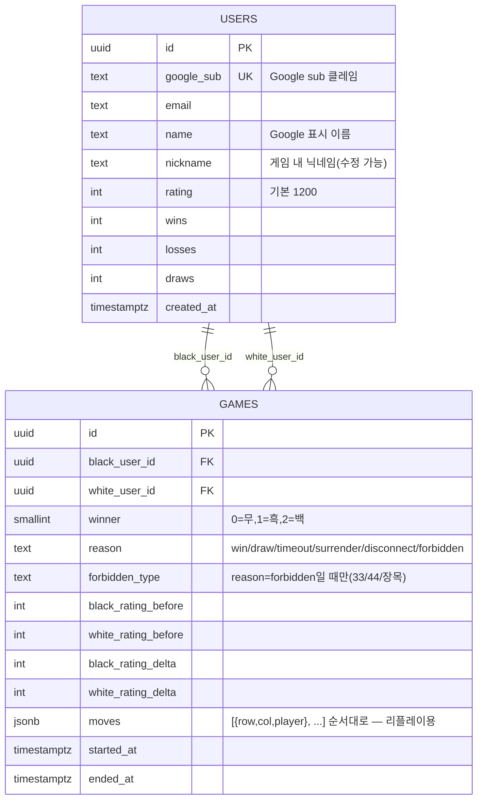

# DB 스키마 — 랭킹전 레이팅 · 기보

> **작성일**: 2026-07-09
> **범위**: 랭킹전(로그인 필수) 대국만 저장. 공개방·AI 대전은 기존처럼 서버 메모리에서만 관리하고 영구 저장하지 않음.

---

## 1. 왜 DB인가

`server/data/ratings.json`(ELO 레이팅)과 `server/data/users.json`(Google 계정 매핑)은 로컬 디스크 단일 파일 읽기/쓰기 방식이라 동시 쓰기 경합, 멀티 서버 확장, 배포 환경 이전을 고려하지 않았다(`docs/TECHNICAL_SPEC.md` 9절 "알려진 제약사항" 참고). 여기에 새로 필요한 기보(대국 기록) 저장까지 파일 기반으로 늘리는 대신, 이번에 PostgreSQL로 옮긴다.

- 로컬 개발: Docker Compose로 띄운 Postgres
- 배포(예정): AWS RDS PostgreSQL — 로컬과 동일 엔진이라 마이그레이션 SQL 그대로 재사용

## 2. ERD



## 3. 테이블 설계 노트

### users

현재 `users.json`(googleSub→userId,email,name) + `ratings.json`(userId→rating,wins,losses,draws,nickname)을 한 테이블로 병합했다. 두 파일이 사실상 1:1 관계라 별도 조인 테이블을 둘 이유가 없다.

### games

승/패/무 결과와 사유(`winner`/`reason`/`forbidden_type`)는 현재 `game:over` payload(`server/index.js`)와 그대로 매핑되도록 필드명을 맞춰 서버 코드 변경을 최소화한다.

`black_rating_before`/`white_rating_before`를 스냅샷으로 남기는 이유: `users.rating`은 계속 바뀌므로, 나중에 "이 대국 당시 상대 레이팅이 몇이었는지"를 보여주려면 그 시점 값이 별도로 필요하다.

**moves를 정규화 테이블 대신 JSONB 컬럼으로 둔 이유**: 기보는 "게임이 끝날 때 한 번에 통째로 쓰고, 나중에 통째로 읽어 리플레이하는" 접근 패턴이라 `game_moves`(game_id/move_no/row/col/player) 같은 별도 테이블보다 컬럼 하나가 더 실용적이다. 서버가 이미 메모리에 들고 있는 착수 순서를 게임 종료 시점에 그대로 직렬화해 INSERT 한 번으로 끝낼 수 있다. 나중에 "N수째 국면으로 검색" 같은 쿼리가 실제로 필요해지면 그때 정규화 테이블로 쪼갠다(YAGNI).

### 인덱스

- `games(black_user_id)`, `games(white_user_id)` — "내 전적" 조회
- `games(ended_at DESC)` — 최신순 정렬
- `users(google_sub)` UNIQUE — 로그인 시 조회

## 4. 마이그레이션 파일

`server/db/schema.sql` — DDL 원본. `server/db/migrate.js`가 `CREATE TABLE IF NOT EXISTS`로 실행한다(멱등, 별도 마이그레이션 프레임워크 없이 단일 스키마 파일 재실행 방식 — 테이블 수가 2개뿐인 현재 규모에 맞춘 최소 구성).

## 5. 로컬 개발 환경

```bash
docker compose up -d db        # 로컬 Postgres 컨테이너 기동 (최초 1회)
cd server && npm run migrate   # 스키마 적용
```

`server/.env`에 `DATABASE_URL` 필요 (`.env.example` 참고).

## 6. 이후 과제

- `server/data/ratings.json` / `users.json` → Postgres 데이터 이관 스크립트 (기존 로컬 데이터가 있는 경우)
- 공개방 대국까지 기보 저장 확장 여부 (현재는 랭킹전만)
- "내 전적" 조회 API (`GET /api/games?userId=`) 및 리플레이 UI
